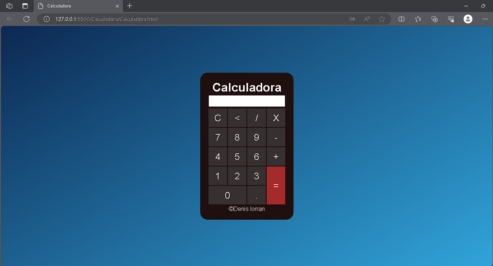

# Calculadora
Um projeto de calculadora simples, utilizando: Javascript, HTML, CSS.
# Funções
Funções de soma, subtração, divisão e multiplicação.
# Como executar:
1. Faça o fork do repositório publico "Calculadora"
2. Abra o Vs code
3. Copie o link do repositorio através do botão code do github
4. Clone o repositório usando o "git clone (link do repositório)" no terminal do seu VS Code
5. Instale a extensão "Live Server", disponível no menu "extensões" do VS Code
6. Clique em Live Server para iniciar o servidor
7. Clique com o botão direito em "Calculadora.html"
8. Clique em "Open with Live Server" e prontinho, sua calculadora está funcional.

# Print do Projeto

